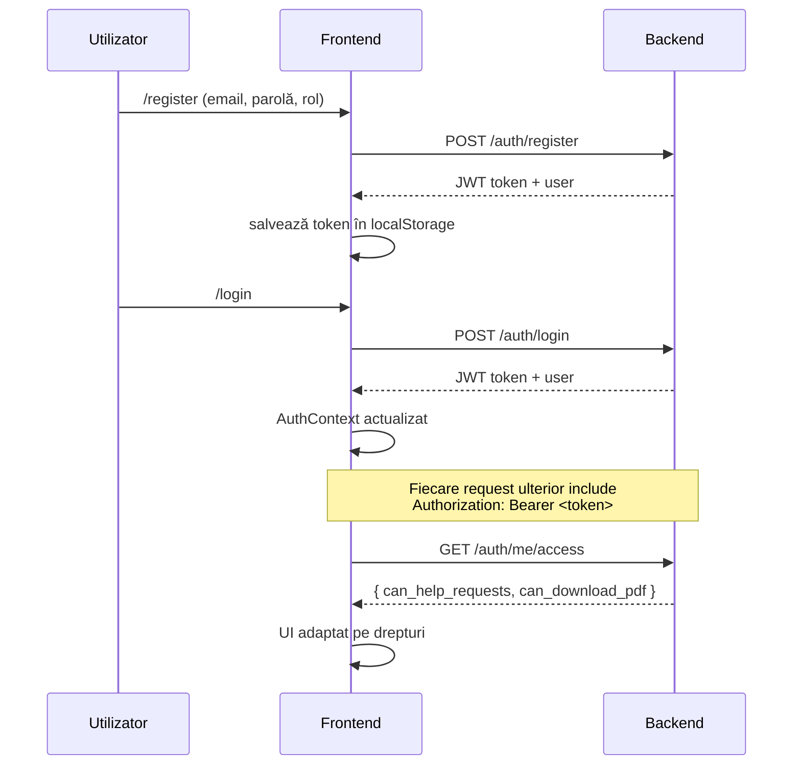
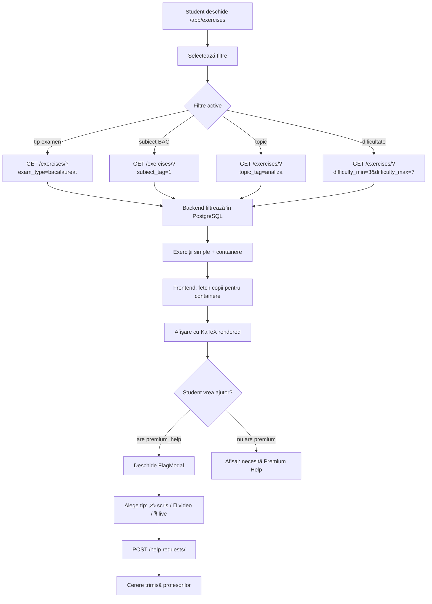
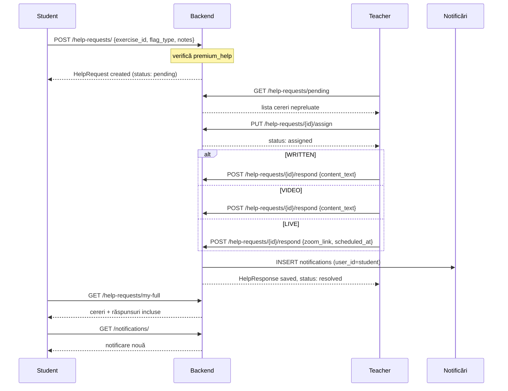

# EtoX Platform — Workflow

## Arhitectură generală

```
┌─────────────────────────────────────────────────────────────┐
│                        Browser                              │
│                   React + TypeScript                        │
│         (Vite · KaTeX · Axios · React Router)              │
└─────────────────────┬───────────────────────────────────────┘
                      │ HTTP / REST
                      ▼
┌─────────────────────────────────────────────────────────────┐
│                  FastAPI (Python)                           │
│   auth · exercises · variants · help · admin · PDF         │
└────────────┬───────────────────────┬────────────────────────┘
             │                       │
             ▼                       ▼
     PostgreSQL (Neon)       Sistem fișiere local
     exercises, users,       uploaded_files/
     variants, subscriptions  (videos răspunsuri)
     help_requests, tags
```

---

## Roluri utilizatori

```
student
  └── browsează exerciții, vede soluțiile
  └── [premium_help] trimite cereri de ajutor (✍️ / 🎥 / 🎙️)
  └── [premium_pdf]  descarcă variante BAC în PDF
  └── [premium]      ambele de mai sus

teacher  (profesor platforma)
  └── vede cereri de ajutor, le preia și răspunde
  └── statistici proprii (cereri, timp mediu)

school_teacher  (profesor școală)
  └── generează variante / fișe de lucru personalizate
  └── [free]    max 5 variante/lună
  └── [premium] variante nelimitate

admin
  └── toate drepturile
  └── gestionează utilizatori și abonamente
  └── vede statisticile oricărui profesor (incl. timp mediu răspuns)
```

---

## Flux autentificare



---

## Flux exerciții (student)



---

## Flux cerere de ajutor



---

## Flux generare variante (school_teacher)

```mermaid
flowchart TD
    A[school_teacher deschide Variant Builder] --> B[GET /variants/my]
    B --> C[Lista variante proprii]
    C --> D[Crează variantă nouă POST /variants/]
    D --> E[Selectează varianta]
    E --> F[Apasă Generează]
    F --> G{Are premium?}
    G -->|free, < 5/lună| H[POST /variants/generate + token]
    G -->|free, ≥ 5/lună| I[403 — limită atinsă]
    G -->|premium| H
    H --> J[Backend: selectează exerciții pe taguri subiect:1/2/3]
    J --> K[Calculează fingerprint SHA256]
    K --> L{Variantă identică există?}
    L -->|da| M[409 Conflict — duplicat]
    L -->|nu| N[Salvează în DB cu user_id]
    N --> O[Afișează exercițiile generate]
    O --> P{Descarcă PDF?}
    P -->|are premium_pdf| Q[GET /variants/{id}/preview-exam]
    P -->|nu are premium_pdf| R[Buton blocat — Premium PDF necesar]
```

---

## Flux abonamente (admin)

```mermaid
flowchart LR
    A[Admin Panel] --> B[GET /admin/users]
    B --> C[Lista utilizatori cu planul activ]
    C --> D{Acțiune}
    D -->|Activează plan| E[POST /admin/subscriptions/{id}/upgrade]
    D -->|Dezactivează| F[DELETE /admin/subscriptions/{id}]
    E --> G[INSERT subscription activ]
    G --> H[UPDATE cel anterior → cancelled]
    F --> I[UPDATE status → cancelled]

    subgraph Planuri
        P1[premium_help] -->|permite| R1[cereri ajutor]
        P2[premium_pdf]  -->|permite| R2[descărcare PDF]
        P3[premium]      -->|permite| R3[ambele]
    end
```

---

## Structura bazei de date

```
users
  id, email, full_name, role, is_active, created_at

subscriptions
  id, user_id → users, plan_type, status, expires_at, created_at

exercises
  id, exam_type, profile, subject_part, statement_latex,
  answer_latex, solution_latex, difficulty, points,
  metadata (JSONB: is_container, parent_external_id, path, subpoint),
  status, created_at

tags
  id, namespace, key, label, parent_id → tags

exercise_tags
  id, exercise_id → exercises, tag_id → tags, weight

variants
  id, name, exam_type, profile, year, session, total_points,
  created_by_user_id_fk → users, fingerprint, status, created_at

variant_exercises
  id, variant_id → variants, exercise_id → exercises,
  order_index, section_name, points

help_requests
  id, student_id → users, exercise_id → exercises,
  flag_type (WRITTEN/VIDEO/LIVE), status, notes,
  assigned_teacher_id → users, created_at

help_responses
  id, request_id → help_requests, teacher_id → users,
  content_text, zoom_link, scheduled_at, created_at

notifications
  id, user_id → users, type, title, body, is_read,
  related_id, created_at
```

---

## Structura proiect

```
edu-platform/
├── docker-compose.yml
├── .env                        ← local only, nu în git
│
├── edu_content_api/            ← FastAPI backend
│   ├── main.py                 ← toate endpoint-urile
│   ├── auth.py                 ← JWT, bcrypt, dependențe premium
│   ├── models.py               ← Pydantic schemas
│   ├── database.py             ← connection pool psycopg3
│   ├── variant_generator.py    ← logică generare variante BAC
│   ├── import_json.py          ← import exerciții din JSON
│   ├── html_generator.py       ← preview HTML cu LaTeX
│   ├── pdf_generator.py        ← export PDF (WeasyPrint)
│   ├── migrations/             ← SQL scripts
│   └── requirements.txt
│
└── frontend/                   ← React + TypeScript
    └── src/
        ├── App.tsx             ← routing, navbar, guards
        ├── AuthContext.tsx     ← JWT context, roluri, drepturi
        ├── api.ts              ← axios + toate apelurile API
        └── components/
            ├── StudentExercises.tsx   ← browsing + filtrare
            ├── TeacherDashboard.tsx   ← cereri ajutor + statistici
            ├── AdminPanel.tsx         ← gestionare useri/abonamente
            ├── VariantBuilderAuto.tsx ← generare variante
            ├── MyRequests.tsx         ← răspunsuri student
            └── LatexRenderer.tsx      ← KaTeX inline/block
```
